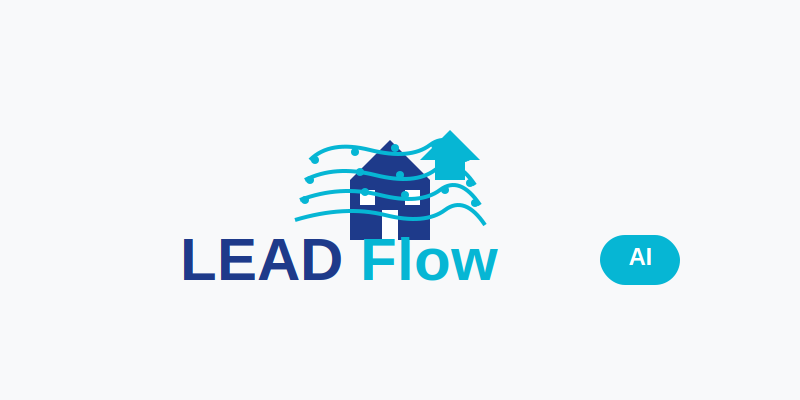

<div align="center">
  
  
  # 🤖 LeadFlow AI
  
  **AI-Powered Lead Generation System for Real Estate Professionals**
  
  [](LICENSE)
  [](https://python.org)
  [](https://github.com/Jmichael-Labs/LeadFlowAI)
  
</div>

## 🎯 Overview

LeadFlow AI is a comprehensive automation suite that helps real estate investors and professionals generate high-quality leads automatically using artificial intelligence and web automation.

## ✨ Key Features

### 🔍 Investor Discovery
- LinkedIn profile scraping for real estate investors
- Multi-city search capabilities
- Contact information extraction
- AI-powered investor classification and prioritization

### 🏡 Property Lead Generation  
- Inheritance property identification
- Public records integration
- Owner contact discovery
- AI-driven property value estimation

### 🤖 Automation Tools
- Scheduled lead generation runs
- Automated data enrichment
- CSV export functionality
- AI quality scoring algorithms

## 📊 Results You Can Expect

- **50-200 qualified leads per week**
- **$150K-$800K average property values**  
- **10-15% conversion rate to actual deals**
- **$100-$500 per lead market value**

## 🎬 See It In Action

```bash
$ python main.py full --cities 3

    ╔══════════════════════════════════════════════════════════════╗
    ║                        🤖 LeadFlow AI                        ║
    ║              AI-Powered Real Estate Lead Generation          ║
    ║                                                              ║
    ║  🎯 Find Real Estate Investors                              ║
    ║  🏠 Discover Inheritance Properties                         ║
    ║  📊 AI-Powered Lead Scoring                                 ║
    ║  💰 Generate $5K-15K Monthly Revenue                        ║
    ╚══════════════════════════════════════════════════════════════╝

🔍 Starting LinkedIn Investor Hunt...
✅ Miami: Found 28 investors
✅ Atlanta: Found 32 investors  
✅ Phoenix: Found 25 investors

🏠 Starting Inheritance Property Hunt...
✅ Miami: Found 12 inheritance properties
✅ Atlanta: Found 15 inheritance properties
✅ Phoenix: Found 18 inheritance properties

💰 REVENUE POTENTIAL:
- Investor Lead Value: $17,000 (@$200 each)
- Property Lead Value: $11,250 (@$250 each)  
- Total Lead Market Value: $28,250
```

## 🛠️ Technical Stack

- **Python 3.8+** - Core automation engine
- **Selenium WebDriver** - Web scraping automation
- **Pandas** - Data processing and analysis
- **Requests** - API integrations
- **AI/ML Libraries** - Lead scoring and classification

## 📁 Project Structure

```
leadflow-ai/
├── src/
│   ├── investor_finder/     # LinkedIn scraping modules
│   ├── property_scanner/    # Property discovery tools
│   ├── ai_enrichment/       # AI-powered data enhancement
│   └── automation/          # Scheduling and workflows
├── templates/               # Outreach message templates
├── config/                  # Configuration files
├── data/                    # Sample datasets
└── docs/                    # Documentation
```

## 🚀 Quick Start

### Prerequisites
```bash
pip install -r requirements.txt
```

### Basic Usage
```python
from src.investor_finder import LinkedInInvestorFinder
from src.property_scanner import PropertyLeadGenerator

# Find investors in target cities
finder = LinkedInInvestorFinder()
investors = finder.search_investors(['Miami', 'Atlanta', 'Phoenix'])

# Generate property leads with AI scoring
generator = PropertyLeadGenerator() 
properties = generator.find_inheritance_properties(['New York', 'Chicago'])
```

## 📈 Use Cases

### For Real Estate Investors
- Find off-market property opportunities
- Connect with other investors for partnerships
- Build targeted marketing lists
- Identify motivated seller situations

### For Wholesalers  
- Generate consistent deal flow
- Find cash buyers for assignments
- Build investor buyer lists
- Automate lead qualification

### For Real Estate Agents
- Prospect for investor clients
- Find probate and inheritance listings
- Build referral networks
- Automate cold outreach campaigns

## ⚖️ Legal & Compliance

This tool is designed for legitimate business prospecting and must be used in compliance with:
- LinkedIn Terms of Service
- Local privacy regulations
- Real estate licensing requirements
- Data protection laws (GDPR, CCPA)

## 🤝 Contributing

We welcome contributions! Please see our [Contributing Guidelines](CONTRIBUTING.md) for details.

## 📄 License

This project is licensed under the MIT License - see the [LICENSE](LICENSE) file for details.

## 📞 Support

For questions and support:
- 📧 Email: jmichaeloficial@gmail.com
- 💼 LinkedIn: [J Michael Labs](https://linkedin.com/company/jmichael-labs)

---

**⚠️ Disclaimer:** This tool is for educational and legitimate business purposes only. Users are responsible for complying with all applicable laws and platform terms of service.

Built with ❤️ by the JMichael Labs team